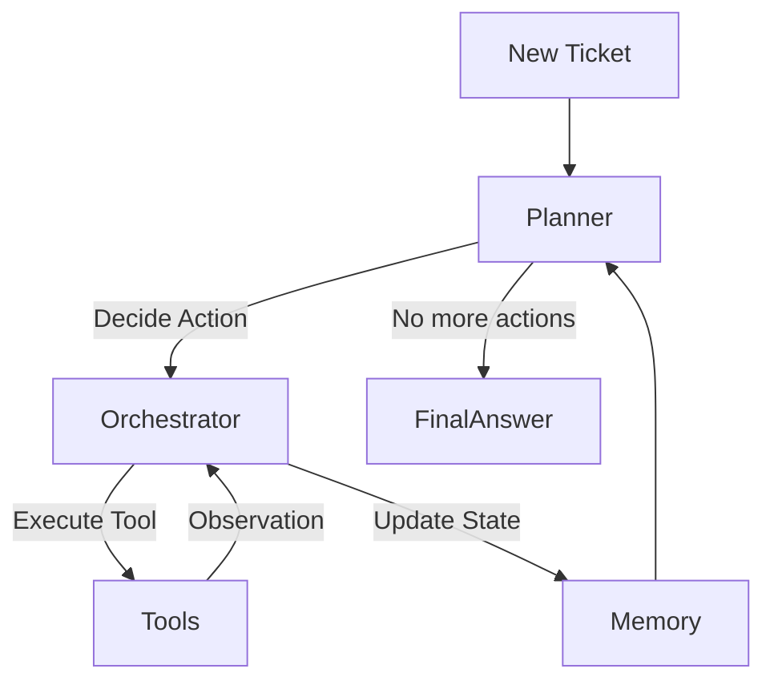
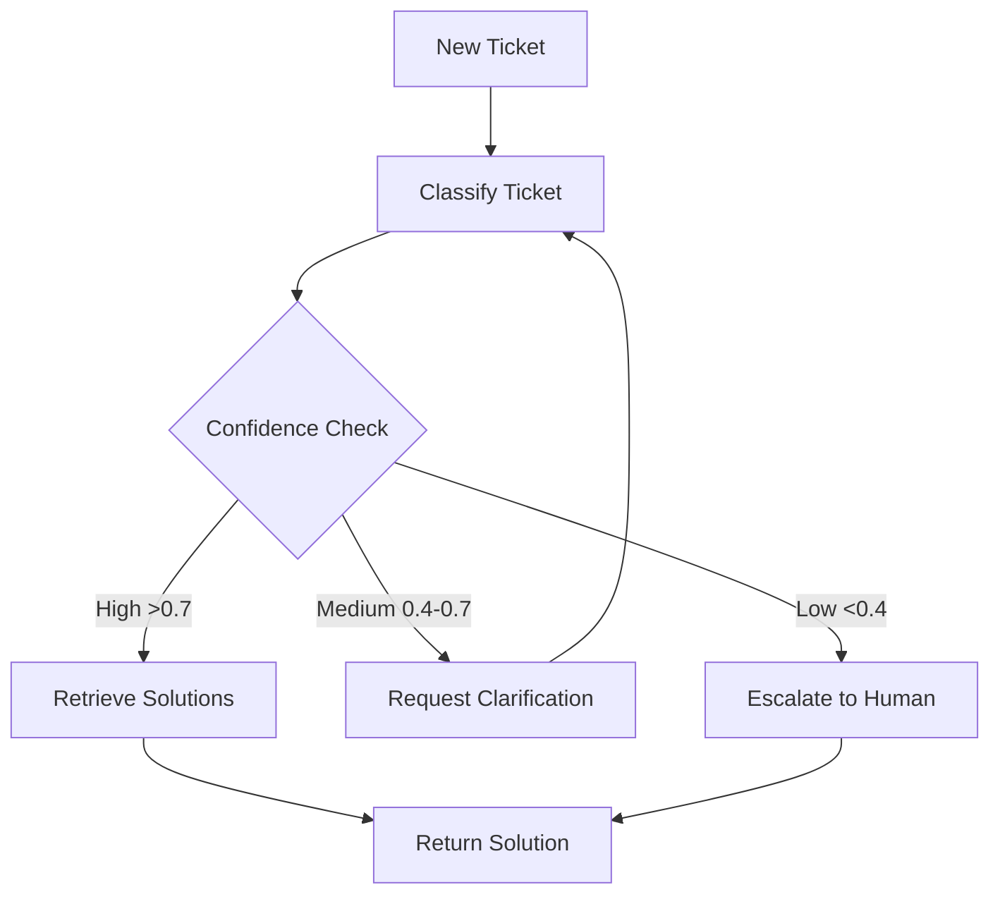

# Agentic AI Architecture

## Overview
This document describes the evolved Multi-Agent Architecture for InsightDesk AI. The system now employs a **Plan-Act-Observe-Reflect** loop to dynamically solve support tickets, rather than a static pipeline.

## Implementation Versions

### Version 1: Rule-Based Orchestrator
- **File**: `src/agentic/orchestrator.py`
- **Planner**: `RuleBasedPlanner` with hardcoded logic
- **Workflow**: Linear (classify → retrieve → finish)
- **Status**: Production-ready, stable

### Version 2: LangGraph Orchestrator (NEW ✨)
- **File**: `src/agentic/orchestrator_langgraph.py`
- **Planner**: Graph-based with conditional routing
- **Workflow**: Dynamic with confidence-based branching
- **Status**: Available for testing and gradual migration
- **Documentation**: See `LANGGRAPH_README.md`

## Core Concepts

### 1. The Loop (Rule-Based)
Instead of hardcoding `Classify -> Search -> Reply`, the **Orchestrator** asks a **Planner** (LLM or Heuristic) what to do next based on the current `AgentState`.



### 2. Enhanced Loop (LangGraph)
The LangGraph version adds conditional routing and iterative refinement:



**Key Improvements**:
- ✅ Conditional routing based on classification confidence
- ✅ Iterative refinement through clarification loops
- ✅ Automatic escalation for edge cases
- ✅ Built-in state persistence and checkpointing
- ✅ Visual workflow representation

### 3. Agents & Tools
- **Planner Agent**: Decides the next step
  - `RuleBasedPlanner`: Hardcoded logic (v1)
  - `LangGraphWorkflow`: Graph-based conditional routing (v2)
- **Classification Tool**: Wraps `src.models`. Predicts category/priority.
- **RAG Tool**: Wraps `src.retrieval`. Searches the vector database.

### 4. Memory
- **Short-term**: `AgentState.history` tracks all actions and observations in the current session.
- **Long-term**: (Planned) Vector store for past successful execution paths.
- **Checkpointing** (LangGraph): Persistent state storage for resumable execution.

## Directory Structure
```
src/agentic/
├── core.py                      # Interfaces for Agents, Tools, Actions
├── orchestrator.py              # Rule-based orchestrator (v1)
├── orchestrator_langgraph.py    # LangGraph orchestrator (v2) ✨ NEW
├── planner.py                   # Rule-based planner
├── memory.py                    # Memory management
└── tools/                       # Tool implementations
    ├── ml_tools.py             # Classification tool
    └── rag_tools.py            # RAG search tool

scripts/
├── test_agent_simple.py         # Tests for rule-based orchestrator
└── test_langgraph_agent.py      # Tests for LangGraph orchestrator ✨ NEW
```

## LangGraph Features

### Conditional Routing
Routes tickets based on classification confidence:
- **High confidence (>0.7)**: Direct to solution retrieval
- **Medium confidence (0.4-0.7)**: Request clarification, retry classification
- **Low confidence (<0.4)**: Escalate to human agent

### State Management
Automatic state persistence across nodes:
```python
class TicketState(TypedDict):
    ticket_data: dict          # Original ticket
    classification: dict       # Classification results
    solutions: list           # Retrieved solutions
    confidence: float         # Classification confidence
    messages: list           # Execution log
    retry_count: int         # Retry counter
    status: str              # Workflow status
```

### Checkpointing
Save and resume workflows at any point:
```python
from langgraph.checkpoint.sqlite import SqliteSaver

checkpointer = SqliteSaver.from_conn_string("checkpoints.db")
workflow = workflow.compile(checkpointer=checkpointer)
```

### Visualization
Generate visual representations of workflows:
```python
graph = workflow.get_graph()
print(graph.draw_mermaid())
```

## Evaluation Metrics for Agents

### Existing Metrics
1. **Goal Completion Rate**: % of tickets where Plan ends in "Success".
2. **Steps to Solution**: Average number of tool calls (lower is better for simple tasks).
3. **Bad Hallucinations**: % of times the planner calls a non-existent tool or invents parameters.
4. **Reflection Quality**: (For LLMs) Ability to catch its own errors (e.g. "Search returned 0 results, I should try broader keywords").

### New Metrics (LangGraph)
5. **Routing Accuracy**: % of tickets routed correctly based on confidence
6. **Clarification Success Rate**: % of medium-confidence tickets resolved after clarification
7. **Escalation Rate**: % of tickets escalated to humans (lower is better)
8. **Retry Efficiency**: Average number of retries before resolution
9. **Checkpoint Recovery**: % of workflows successfully resumed from checkpoints

## Usage

### Rule-Based Orchestrator (v1)
```python
from src.agentic.orchestrator import AgentOrchestrator

orchestrator = AgentOrchestrator()
result = orchestrator.run(ticket_data, max_steps=5)
```

### LangGraph Orchestrator (v2)
```python
from src.agentic.orchestrator_langgraph import LangGraphOrchestrator

orchestrator = LangGraphOrchestrator()
result = orchestrator.run(ticket_data, max_steps=10)
```

### API Endpoint
Send a POST request to `/agent/solve` with the ticket data:
```bash
curl -X POST http://localhost:8000/agent/solve \
  -H "Content-Type: application/json" \
  -d '{
    "ticket_id": "T-123",
    "subject": "Cannot login",
    "description": "User unable to authenticate",
    "priority": "high",
    "product": "web_application"
  }'
```

## Migration Path

### Phase 1: Parallel Deployment (Current)
- Both orchestrators available
- Feature flag to switch between versions
- A/B testing in production

### Phase 2: Gradual Migration
- Route specific ticket types to LangGraph
- Monitor performance and accuracy
- Collect feedback and iterate

### Phase 3: Full Migration
- LangGraph becomes default
- Rule-based orchestrator deprecated
- Enhanced workflows (multi-agent, human-in-loop)

## Next Steps

1. **Install LangGraph**: `pip install -r requirements.txt`
2. **Run Tests**: `python scripts/test_langgraph_agent.py`
3. **Review Documentation**: See `LANGGRAPH_README.md`
4. **Test Integration**: Try LangGraph orchestrator with real tickets
5. **Provide Feedback**: Report issues and suggestions

## Resources

- **LangGraph Integration Plan**: `.agent/langgraph_integration_plan.md`
- **LangGraph README**: `LANGGRAPH_README.md`
- **Test Script**: `scripts/test_langgraph_agent.py`
- **LangGraph Docs**: https://python.langchain.com/docs/langgraph
