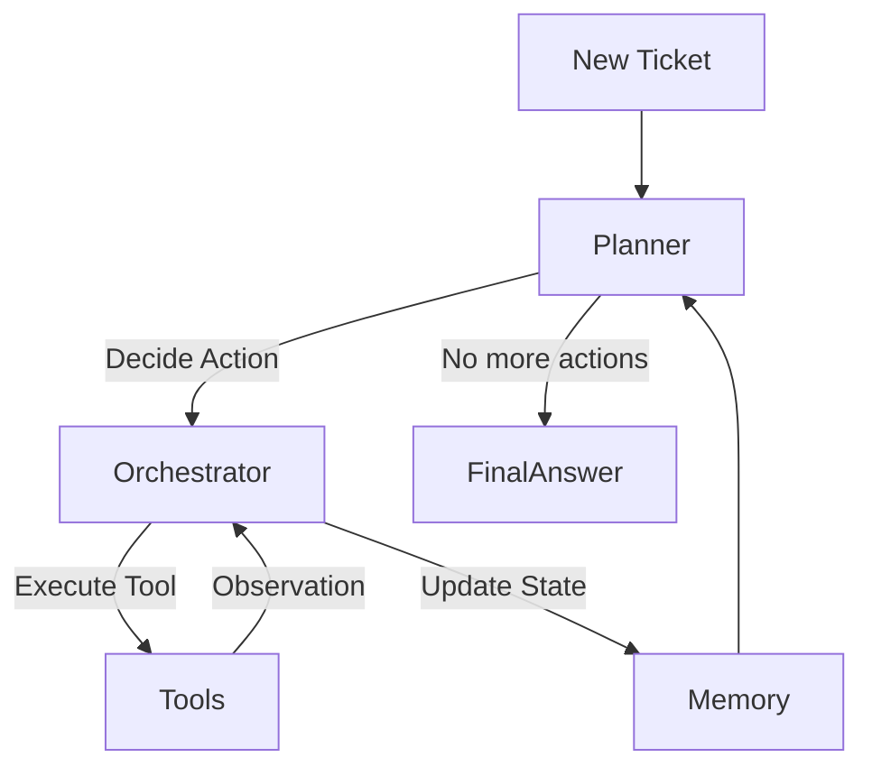

# Agentic AI Architecture

## Overview
This document describes the evolved Multi-Agent Architecture for InsightDesk AI. The system now employs a **Plan-Act-Observe-Reflect** loop to dynamically solve support tickets, rather than a static pipeline.

## Core Concepts

### 1. The Loop
Instead of hardcoding `Classify -> Search -> Reply`, the **Orchestrator** asks a **Planner** (LLM or Heuristic) what to do next based on the current `AgentState`.

### 2. Agents & Tools
- **Planner Agent**: Decides the next step. Currently a "RuleBasedPlanner" but designed to be swapped with `OpenAIPlanner`.
- **Classification Tool**: Wraps `src.models`. Predicts category/priority.
- **RAG Tool**: Wraps `src.retrieval`. Searches the vector database.

### 3. Memory
- **Short-term**: `AgentState.history` tracks all actions and observations in the current session.
- **Long-term**: (Planned) Vector store for past successful execution paths.

## Directory Structure
- `src/agentic/core.py`: Interfaces for Agents, Tools, Actions.
- `src/agentic/orchestrator.py`: The main loop runner.
- `src/agentic/tools/`: Wrappers for existing ML/RAG capability.

## Evaluation Metrics for Agents
1. **Goal Completion Rate**: % of tickets where Plan ends in "Success".
2. **Steps to Solution**: Average number of tool calls (lower is better for simple tasks).
3. **Bad Hallucinations**: % of times the planner calls a non-existent tool or invents parameters.
4. **Refiection Quality**: (For LLMs) Ability to catch its own errors (e.g. "Search returned 0 results, I should try broader keywords").

## Usage
Send a POST request to `/agent/solve` with the ticket data.
