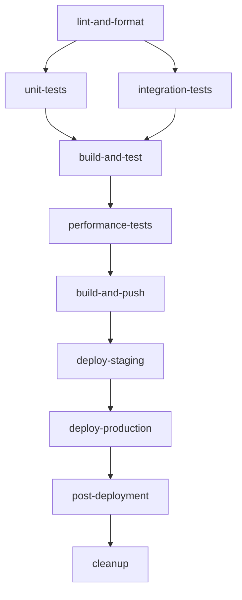

# 🚀 CI/CD Quick Reference

## Overview
This document provides a quick reference for working with the InsightDesk AI CI/CD pipeline powered by GitHub Actions.

## 🔧 Pipeline Triggers

| Trigger | When | Jobs Executed |
|---------|------|---------------|
| Push to `main` | Code pushed to main branch | All 10 jobs |
| Pull Request | PR opened/updated to main | Jobs 1-5 (no deployment) |
| Manual Dispatch | Via GitHub UI or CLI | Configurable (staging/production) |
| Schedule | Daily at 2 AM UTC | Health checks only |

## 📋 Job Dependencies



## 🛠️ Local Development Commands

### Pre-commit Checks
```bash
# Format code
black .
isort .

# Lint code
flake8 .
bandit -r src/

# Security check dependencies
safety check

# Run tests
pytest --cov=src tests/

# Full local validation
make lint test build  # If using Makefile
```

### Quick Test Commands
```bash
# Run specific test categories
pytest -m unit          # Unit tests only
pytest -m integration   # Integration tests only
pytest -m "not slow"    # Skip slow tests

# Run with different Python versions (if using tox)
tox -e py310,py311,py312
```

## 🐳 Docker Development

### Local Docker Testing
```bash
# Build image
docker build -t insightdesk-ai:local .

# Run with health check
docker run --rm -p 8000:8000 --health-cmd="curl -f http://localhost:8000/health || exit 1" insightdesk-ai:local

# Test API endpoints
curl http://localhost:8000/health
curl http://localhost:8000/models/status
```

### Multi-stage Build Testing
```bash
# Test specific build stage
docker build --target test -t insightdesk-ai:test .
docker run --rm insightdesk-ai:test
```

## 🔒 Security Scanning

### Manual Security Checks
```bash
# Code security
bandit -r src/ -f json -o bandit-report.json

# Dependency vulnerabilities  
safety check --json --output safety-report.json

# Container security (requires Trivy)
trivy image insightdesk-ai:latest
```

## 📊 Performance Testing

### Benchmarking Commands
```bash
# Quick benchmark test
python scripts/test_benchmark_quick.py

# Full model comparison
python scripts/benchmark_models.py --output demo_results/

# A/B testing demo
python scripts/demo_benchmarking.py
```

## 🚨 Troubleshooting

### Common Pipeline Failures

| Error | Cause | Solution |
|-------|-------|----------|
| Import errors | Missing dependencies | Check requirements.txt |
| Linting failures | Code format issues | Run `black .` and `isort .` |
| Test failures | Test environment issues | Check test database setup |
| Docker build fails | Dockerfile issues | Test build locally |
| Security scan fails | Vulnerable dependencies | Update requirements.txt |

### Pipeline Status Checks

```bash
# Check workflow status
gh workflow list
gh run list --workflow=ci-cd.yml

# View specific run logs
gh run view <run-id> --log

# Re-run failed jobs
gh run rerun <run-id> --failed
```

### Environment Variables

| Variable | Description | Required |
|----------|-------------|----------|
| `DOCKER_REGISTRY` | Container registry URL | Yes (for push) |
| `DOCKER_USERNAME` | Registry username | Yes (for push) |
| `DOCKER_PASSWORD` | Registry password | Yes (for push) |
| `CODECOV_TOKEN` | Coverage reporting | No |
| `SLACK_WEBHOOK` | Notifications | No |

## 🎯 Best Practices

### Before Pushing Code
1. ✅ Run tests locally: `pytest`
2. ✅ Format code: `black . && isort .`
3. ✅ Check linting: `flake8 .`
4. ✅ Security scan: `bandit -r src/`
5. ✅ Update documentation if needed

### Pull Request Guidelines
1. 📝 Use descriptive commit messages
2. 🧪 Ensure all tests pass
3. 📊 Include performance impact notes
4. 🔒 Address security scan findings
5. 📚 Update documentation for new features

### Emergency Procedures

#### Hotfix Deployment
```bash
# Create hotfix branch
git checkout -b hotfix/critical-fix main

# Make changes and test
git commit -m "hotfix: critical issue description"

# Push and create PR
git push origin hotfix/critical-fix
gh pr create --title "Hotfix: Critical Issue" --body "Description of fix"
```

#### Pipeline Bypass (Emergency Only)
```bash
# Skip CI for emergency fixes (use sparingly)
git commit -m "emergency fix [skip ci]"
```

#### Rollback Deployment
```bash
# Manual rollback (requires access to deployment environment)
# This depends on your deployment platform (AWS/GCP/Azure)
# Example for container deployment:
docker pull insightdesk-ai:previous-tag
docker service update --image insightdesk-ai:previous-tag production-service
```

## 📞 Support

### Getting Help
- 📋 **Pipeline Issues**: Create GitHub issue with `ci/cd` label
- 🐛 **Bug Reports**: Include pipeline run URL and error logs
- 💡 **Feature Requests**: Use `enhancement` label
- 📚 **Documentation**: Check `.github/workflows/` directory

### Useful Links
- [GitHub Actions Documentation](https://docs.github.com/en/actions)
- [Docker Best Practices](https://docs.docker.com/develop/dev-best-practices/)
- [Python Testing Best Practices](https://pytest.org/en/latest/good.html)

---

**Last Updated**: December 2024  
**Pipeline Version**: v1.0.0