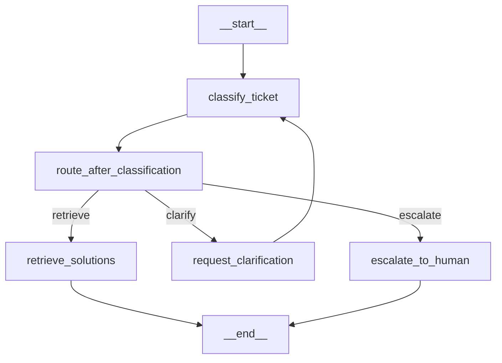

# LangGraph Integration for InsightDesk AI

## Overview

This implementation adds **LangGraph** to the InsightDesk AI agentic system, providing a graph-based approach to workflow orchestration with advanced features like conditional routing, state persistence, and iterative refinement.

## What is LangGraph?

LangGraph is a library for building stateful, multi-actor applications with LLMs. It extends LangChain with the ability to coordinate multiple chains (or actors) across multiple steps of computation in a cyclic manner using a graph structure.

### Key Benefits

1. **Graph-Based Workflows**: Define agent workflows as directed graphs with nodes and edges
2. **Conditional Routing**: Dynamic branching based on intermediate results (e.g., classification confidence)
3. **State Management**: Automatic state persistence and updates across nodes
4. **Checkpointing**: Save and resume agent execution at any point
5. **Cycles & Loops**: Support for iterative refinement (e.g., retry with clarification)
6. **Visualization**: Generate visual representations of workflows for documentation

## Architecture Comparison

### Before (Rule-Based Planner)
```
classify_ticket → retrieve_solutions → finish
```
- Fixed, linear workflow
- No conditional logic
- Cannot handle edge cases
- Manual state management

### After (LangGraph)
```
START → classify_ticket → [confidence check]
                          ├─ high (>0.7) → retrieve_solutions → END
                          ├─ medium (0.4-0.7) → request_clarification → classify_ticket (loop)
                          └─ low (<0.4) → escalate_to_human → END
```
- Conditional routing based on confidence
- Iterative refinement through clarification
- Automatic escalation for edge cases
- Built-in state management

## Implementation Details

### Files Created

1. **`src/agentic/orchestrator_langgraph.py`** - Main LangGraph orchestrator
   - `LangGraphOrchestrator` class (drop-in replacement for `AgentOrchestrator`)
   - Graph nodes: `classify_ticket_node`, `retrieve_solutions_node`, `request_clarification_node`, `escalate_to_human_node`
   - Conditional routing: `route_after_classification`
   - State schema: `TicketState` (TypedDict)

2. **`scripts/test_langgraph_agent.py`** - Comprehensive test suite
   - Tests for different confidence scenarios
   - Workflow visualization
   - Comparison with original orchestrator

3. **`.agent/langgraph_integration_plan.md`** - Detailed integration plan
   - Architecture overview
   - Implementation roadmap
   - Migration strategy

### State Schema

```python
class TicketState(TypedDict):
    ticket_data: dict          # Original ticket information
    classification: dict       # Classification results
    solutions: list           # Retrieved solutions
    confidence: float         # Classification confidence (0.0-1.0)
    messages: list           # Execution log (accumulated)
    retry_count: int         # Number of retries
    status: str              # Workflow status
    error: str | None        # Error message if any
```

### Workflow Nodes

1. **classify_ticket_node**: Analyzes ticket and predicts category/priority
2. **retrieve_solutions_node**: Searches knowledge base using RAG
3. **request_clarification_node**: Handles medium-confidence cases (placeholder for user interaction)
4. **escalate_to_human_node**: Escalates low-confidence or failed cases

### Conditional Routing Logic

```python
def route_after_classification(state: TicketState):
    confidence = state["confidence"]
    retry_count = state["retry_count"]
    
    if retry_count >= 2 or state["error"]:
        return "escalate"
    elif confidence > 0.7:
        return "retrieve"
    elif confidence > 0.4:
        return "clarify"
    else:
        return "escalate"
```

## Installation

### 1. Install Dependencies

```bash
pip install -r requirements.txt
```

This will install:
- `langgraph>=0.0.20`
- `langchain>=0.1.0`
- `langchain-community>=0.0.10`
- `langchain-core>=0.1.0`

### 2. Verify Installation

```bash
python -c "import langgraph; print('LangGraph version:', langgraph.__version__)"
```

## Usage

### Basic Usage

```python
from src.agentic.orchestrator_langgraph import LangGraphOrchestrator

# Initialize orchestrator
orchestrator = LangGraphOrchestrator()

# Process a ticket
ticket = {
    "ticket_id": "T-123",
    "subject": "Cannot login to application",
    "description": "User is unable to authenticate with correct credentials.",
    "priority": "high",
    "product": "web_application"
}

# Run workflow
result = orchestrator.run(ticket, max_steps=10)

# Check results
print(f"Status: {result['status']}")
print(f"Confidence: {result['confidence']:.2%}")
print(f"Classification: {result['analysis']['classification']}")
print(f"Solutions: {len(result['analysis']['suggested_solutions'])}")
```

### API Integration

The LangGraph orchestrator is a drop-in replacement for the original orchestrator:

```python
# In src/api/main.py
from src.agentic.orchestrator_langgraph import LangGraphOrchestrator

@app.post("/agent/solve")
async def solve_ticket(ticket: TicketRequest):
    orchestrator = LangGraphOrchestrator()
    result = orchestrator.run(ticket.dict())
    return result
```

## Testing

### Run All Tests

```bash
python scripts/test_langgraph_agent.py
```

This will run:
1. **Basic Functionality Test**: Tests different confidence scenarios
2. **Workflow Visualization Test**: Generates graph representation
3. **Orchestrator Comparison Test**: Compares with original orchestrator

### Expected Output

```
🚀 LangGraph Agent Testing Suite

Test 1: Basic Functionality
====================================================================
📋 Test Case: High Confidence Ticket
Ticket ID: TEST-LG-001
Subject: Cannot login to application
Expected Flow: classify → retrieve (high confidence)

🔄 Running LangGraph workflow...
✅ Status: success
✅ Classification confidence: 85.00%
✅ Classification: authentication
✅ Found 3 solutions
🎉 Test case PASSED - Status: success

====================================================================
FINAL TEST RESULTS
====================================================================
✅ PASSED - Basic Functionality
✅ PASSED - Visualization
✅ PASSED - Comparison

🎉 ALL TESTS PASSED!
```

## Workflow Visualization

### Generate Mermaid Diagram

```python
from src.agentic.orchestrator_langgraph import create_ticket_workflow

workflow = create_ticket_workflow()
compiled = workflow.compile()
graph = compiled.get_graph()

# Print Mermaid diagram
print(graph.draw_mermaid())
```

### Example Mermaid Output



## Advanced Features

### 1. Checkpointing (State Persistence)

```python
from langgraph.checkpoint.sqlite import SqliteSaver

# Use SQLite for persistent checkpointing
checkpointer = SqliteSaver.from_conn_string("checkpoints.db")
workflow = create_ticket_workflow()
compiled = workflow.compile(checkpointer=checkpointer)

# Resume from checkpoint
result = compiled.invoke(
    initial_state,
    config={"configurable": {"thread_id": "ticket-123"}}
)
```

### 2. Human-in-the-Loop

```python
def human_approval_node(state: TicketState) -> dict:
    """Wait for human approval before proceeding."""
    # In production, this would:
    # 1. Send notification to human agent
    # 2. Wait for approval/rejection
    # 3. Update state based on decision
    
    approval = input(f"Approve solution for {state['ticket_data']['ticket_id']}? (y/n): ")
    
    if approval.lower() == 'y':
        return {"status": "approved", "messages": ["Human approved solution"]}
    else:
        return {"status": "rejected", "messages": ["Human rejected solution"]}

# Add to workflow
workflow.add_node("human_approval", human_approval_node)
workflow.add_edge("retrieve_solutions", "human_approval")
workflow.add_edge("human_approval", END)
```

### 3. Parallel Execution

```python
from langgraph.graph import StateGraph

def parallel_analysis_node(state: TicketState) -> dict:
    """Run multiple analyses in parallel."""
    # Execute multiple tools simultaneously
    results = {
        "classification": classify_tool.run(state["ticket_data"]),
        "sentiment": sentiment_tool.run(state["ticket_data"]),
        "urgency": urgency_tool.run(state["ticket_data"])
    }
    return results

workflow.add_node("parallel_analysis", parallel_analysis_node)
```

### 4. Dynamic Tool Selection

```python
def select_specialist(state: TicketState) -> str:
    """Route to specialist based on category."""
    category = state["classification"].get("predicted_category")
    
    specialist_map = {
        "authentication": "auth_specialist",
        "network": "network_specialist",
        "database": "db_specialist"
    }
    
    return specialist_map.get(category, "general_specialist")

workflow.add_conditional_edges(
    "classify_ticket",
    select_specialist,
    {
        "auth_specialist": "auth_specialist_node",
        "network_specialist": "network_specialist_node",
        "db_specialist": "db_specialist_node",
        "general_specialist": "general_specialist_node"
    }
)
```

## Performance Considerations

### Latency
- **Overhead**: ~10-50ms per workflow execution (graph traversal + state management)
- **Optimization**: Use in-memory checkpointer for low-latency scenarios
- **Caching**: Cache compiled workflows to avoid recompilation

### Memory
- **State Size**: Each state snapshot is ~1-5KB (depends on ticket data)
- **Checkpointing**: SQLite checkpointer uses ~10KB per checkpoint
- **Cleanup**: Implement checkpoint cleanup for old/completed workflows

### Scalability
- **Concurrent Workflows**: Each workflow runs independently (thread-safe)
- **Distributed Execution**: Use Redis/Postgres checkpointer for multi-instance deployments
- **Rate Limiting**: Add rate limiting for external API calls in nodes

## Migration Guide

### Option 1: Parallel Deployment (Recommended)

```python
# In src/api/main.py
from src.agentic.orchestrator import AgentOrchestrator
from src.agentic.orchestrator_langgraph import LangGraphOrchestrator

USE_LANGGRAPH = os.getenv("USE_LANGGRAPH", "false").lower() == "true"

@app.post("/agent/solve")
async def solve_ticket(ticket: TicketRequest):
    if USE_LANGGRAPH:
        orchestrator = LangGraphOrchestrator()
    else:
        orchestrator = AgentOrchestrator()
    
    result = orchestrator.run(ticket.dict())
    return result
```

### Option 2: A/B Testing

```python
import random

@app.post("/agent/solve")
async def solve_ticket(ticket: TicketRequest):
    # 50/50 split for A/B testing
    use_langgraph = random.random() < 0.5
    
    if use_langgraph:
        orchestrator = LangGraphOrchestrator()
        result = orchestrator.run(ticket.dict())
        result["orchestrator_version"] = "langgraph"
    else:
        orchestrator = AgentOrchestrator()
        result = orchestrator.run(ticket.dict())
        result["orchestrator_version"] = "original"
    
    return result
```

## Troubleshooting

### Issue: ImportError for langgraph

**Solution**: Install LangGraph dependencies
```bash
pip install langgraph langchain langchain-community
```

### Issue: Recursion limit exceeded

**Solution**: Increase max_steps or fix infinite loop in graph
```python
result = orchestrator.run(ticket, max_steps=20)  # Increase limit
```

### Issue: State not persisting

**Solution**: Use persistent checkpointer
```python
from langgraph.checkpoint.sqlite import SqliteSaver
checkpointer = SqliteSaver.from_conn_string("checkpoints.db")
workflow = workflow.compile(checkpointer=checkpointer)
```

## Future Enhancements

1. **LLM-Based Planning**: Replace rule-based routing with LLM decision-making
2. **Multi-Agent Collaboration**: Specialist agents for different domains
3. **Streaming Responses**: Stream intermediate results to frontend
4. **Tool Calling**: Dynamic tool selection based on LLM reasoning
5. **Memory Integration**: Long-term memory for learning from past tickets
6. **Feedback Loops**: Incorporate user feedback to improve routing decisions

## Resources

- [LangGraph Documentation](https://python.langchain.com/docs/langgraph)
- [LangGraph GitHub](https://github.com/langchain-ai/langgraph)
- [LangGraph Tutorials](https://github.com/langchain-ai/langgraph/tree/main/examples)
- [Multi-Agent Systems](https://python.langchain.com/docs/langgraph/tutorials/multi_agent/)

## Contributing

To add new nodes or modify the workflow:

1. Define node function in `orchestrator_langgraph.py`
2. Add node to workflow: `workflow.add_node("node_name", node_function)`
3. Add edges: `workflow.add_edge("source", "target")`
4. Update tests in `test_langgraph_agent.py`
5. Update documentation

## License

Same as InsightDesk AI project license.
